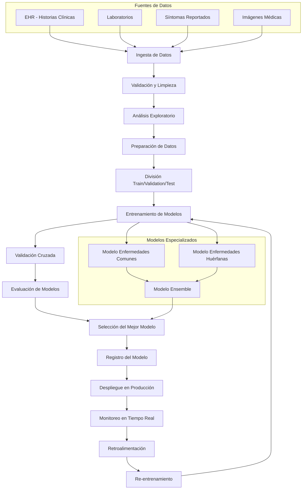

# Diseño del Pipeline de MLOps para Diagnóstico Médico

## 🎯 Descripción

Este documento describe el diseño de un pipeline de MLOps completo para el diagnóstico médico, capaz de manejar tanto enfermedades comunes (con abundantes datos) como enfermedades huérfanas (con datos limitados). 

---

## 📊 Diagrama del Pipeline

---

## Diseño y análisis

El sistema propuesto es una plataforma de apoyo diagnóstico que recibe síntomas del paciente, estima la posible condición clínica y clasifica la severidad del caso. Desde el diseño inicial existen restricciones importantes. La primera es la privacidad, porque se trabaja con información médica sensible. Eso significa que los datos del paciente no pueden circular libremente ni almacenarse de forma insegura. El pipeline debe considerar controles de acceso, trazabilidad de quién vio qué dato y protección tanto en tránsito como en reposo. La segunda restricción es la latencia. El sistema no se usa de forma offline, sino durante la evaluación clínica. Por lo tanto, la respuesta tiene que ser prácticamente inmediata para que tenga valor, especialmente cuando los síntomas apuntan a algo potencialmente serio como dolor de pecho intenso o dificultad para respirar. La tercera restricción es interpretabilidad. Un modelo en salud no puede limitarse a responder “usted está enfermo de gravedad” sin más. El sistema tiene que ser capaz de explicar qué combinación de síntomas lo llevó a esa conclusión, porque un profesional humano va a usar la salida como apoyo y necesita poder entenderla, validarla y, si es necesario, discutirla con el paciente. Finalmente, el diseño tiene que reconocer que no todos los problemas médicos se comportan igual desde el punto de vista de datos. Hay condiciones comunes con muchos ejemplos disponibles y otras raras donde hay muy pocos datos. Eso obliga a estructurar el pipeline para que soporte ambos escenarios en lugar de asumir un único modelo universal.

En cuanto al tipo de información que debe procesar el sistema, hay varias clases de datos relevantes. Están los datos estructurados, como fiebre medida en grados, nivel de dolor reportado en una escala numérica o presencia e intensidad de síntomas específicos como tos, dolor abdominal o dificultad respiratoria. Esos datos son fáciles de usar directamente en los modelos porque tienen formato consistente. Existen también datos derivados de notas médicas o descripciones del paciente, que son texto libre. Ese tipo de información es menos uniforme y puede requerir procesar lenguaje natural para extraer señales útiles. Además, parte de la información clínica es temporal. No basta con saber “hay dolor en el pecho”, importa desde cuándo, si apareció de golpe o si está presente desde hace semanas, y si ha empeorado con el tiempo. Esa evolución en el tiempo también es parte del cuadro clínico y el pipeline debe estar preparado para integrarla cuando esté disponible. El diseño general deja abierta la posibilidad de incorporar más adelante modalidades extra como imágenes médicas o reportes de laboratorio, pero incluso en su forma básica ya tiene que tratar con datos heterogéneos que no vienen todos con el mismo formato ni la misma calidad.

## Desarrollo del modelo y manejo de datos

El pipeline de desarrollo comienza con la ingesta y la limpieza de datos clínicos. En un entorno real esa información llega de varias fuentes: registros clínicos electrónicos del hospital, reportes de laboratorio, auto reporte del paciente y eventualmente dispositivos médicos. Eso normalmente viene con formatos distintos, escalas diferentes y hasta maneras distintas de describir el mismo síntoma. Por ejemplo, un paciente puede decir “me cuesta respirar” mientras que en otro registro aparece como “disnea moderada”. Antes de entrenar cualquier modelo es obligatorio normalizar todo eso en una representación común. Este paso no es cosmético, ya que un error en la estandarización puede enseñar al modelo una correlación equivocada y eso después se traduce en malas decisiones clínicas.

Después de la limpieza se hace la separación clásica en entrenamiento, validación y prueba, con el objetivo de poder medir generalización y no solo memoria. Aquí aparece una decisión importante: el sistema no se plantea como un único modelo monolítico que lo predice todo. En su lugar, se asume que existen al menos dos familias de modelos. Por un lado, hay modelos entrenados con datos de condiciones comunes y frecuentes, como cuadros respiratorios típicos o problemas digestivos leves. Para estos casos se pueden usar clasificadores supervisados estándar, modelos en conjunto como gradient boosting o redes neuronales relativamente simples, porque hay suficientes ejemplos históricos para aprender patrones estables. Por otro lado, hay un bloque diferente enfocado en condiciones menos frecuentes o más críticas, como eventos cardiacos agudos o cuadros neurológicos serios. En esos casos no siempre hay miles de ejemplos disponibles, así que se recurre a estrategias que funcionan con pocos datos, como transferencia de aprendizaje desde modelos ya entrenados en dominios parecidos o enfoques que priorizan la presencia combinada de síntomas clave en lugar de depender solo del volumen estadístico.

Entre esas dos familias de modelos se inserta una lógica de decisión que actúa como orquestador. Su trabajo no es promediar ciegamente, sino priorizar riesgo clínico. Si un modelo “leve” dice que esto parece una infección respiratoria no complicada, pero el modelo especializado en riesgo cardiopulmonar está disparando señales fuertes porque hay dolor torácico severo con dificultad respiratoria alta, el sistema no debe quedarse con el diagnóstico tranquilizador. Debe elevar la gravedad, porque desde el punto de vista clínico el peor caso manda. Ese componente de agregación es parte esencial del pipeline porque lo acerca más a cómo piensa un médico: cuando hay señales de algo potencialmente grave, se trata como grave hasta demostrar lo contrario.

La validación del sistema no se puede limitar a medir accuracy global. En salud importa mucho más qué tan bien detecta los casos que realmente requieren atención urgente y qué tanto evita alarmar sin motivo. Por eso se evalúan métricas que capturan ambas cosas. Sensibilidad alta significa que el sistema casi no deja pasar casos peligrosos etiquetándolos como leves. Especificidad razonable significa que no marca como “grave” a todo el mundo innecesariamente. Además se evalúa el comportamiento del modelo en distintos perfiles de paciente, porque un sistema clínico no puede funcionar bien solo en un subgrupo y mal en otro sin que eso se note. Finalmente, hay una capa explícita de validación humana. Antes de considerar que una versión del modelo está lista para uso clínico, profesionales médicos revisan ejemplos reales y determinan si las salidas del sistema tienen sentido clínico. Eso incluye revisar si la explicación que da el modelo es coherente, si la clasificación de severidad es prudente y si las recomendaciones son aceptables desde la práctica médica.

## Producción, monitoreo y mejora continua

Una vez que el modelo supera la validación técnica y clínica, se despliega como un servicio. La forma práctica de hacerlo es empacar el modelo con su lógica de preprocesamiento y exponerlo mediante una API en un contenedor. Ese contenedor se puede orquestar igual que cualquier otro microservicio, lo que facilita escalar horizontalmente si aumenta el número de consultas. Este enfoque le da al hospital o a la institución un punto claro de integración: el sistema clínico le envía los síntomas estructurados del paciente y recibe de vuelta una clasificación de severidad y, cuando corresponde, una posible condición más probable. El despliegue en contenedores también facilita versionar y auditar. Se puede saber exactamente qué versión del modelo está corriendo, con qué pesos fue entrenado y con qué datos fue validado. Eso es fundamental en salud, porque en caso de auditoría se tiene que poder responder por qué se dio cierta recomendación en una fecha específica.

Cuando el sistema está en producción no basta con que esté disponible. Tiene que ser vigilado activamente. Por un lado se monitorean métricas puramente técnicas, como latencia, disponibilidad y tasa de error de la API. El sistema tiene que responder rápido y de forma estable porque se está usando en el flujo de trabajo clínico. Por otro lado se monitorean métricas clínicas, como la distribución de severidades que el sistema está emitiendo en el tiempo. Si de repente empieza a clasificar a casi todos los pacientes como casos graves, o al contrario deja de marcar casos agudos por completo, eso es señal de que algo cambió en los datos de entrada o en el contexto clínico. Ese fenómeno se conoce como drift y es inevitable en salud, porque la realidad clínica cambia. Aparecen nuevas variantes de virus, cambian los perfiles de paciente que consultan, cambian las guías médicas. El pipeline no puede asumir que el modelo de hoy sirve igual dentro de seis meses. Tiene que detectar ese desajuste y registrarlo.

Ese monitoreo continuo alimenta la última fase del pipeline, que es la mejora iterativa del modelo. Cada cierto tiempo, o cuando se detecta degradación en el rendimiento clínico, se recolectan nuevos ejemplos reales, se vuelven a limpiar y normalizar, y se utilizan para reentrenar o ajustar el modelo. Ese reentrenamiento nunca se hace a ciegas. Antes de reemplazar el modelo en producción se compara la versión actual con la versión nueva en paralelo, usando datos reales recientes. Eso permite ver si el nuevo modelo realmente mejora o si introduce errores peligrosos. Solo cuando el nuevo modelo demuestra ser al menos tan seguro como el anterior y además ofrece una mejora real, se promueve a producción. Toda esta rotación debe quedar registrada de manera formal, incluyendo qué versión estaba activa, cuándo se cambió y por qué se cambió. 

## Conclusión

El pipeline cubre el ciclo completo. Parte desde la ingesta cruda y desordenada de datos clínicos, pasa por limpieza y normalización, entrena modelos adecuados tanto para condiciones comunes como para las menos frecuentes, combina las señales priorizando el riesgo más alto, valida técnica y clínicamente, despliega como servicio reproducible, monitorea el desempeño en tiempo real y se alimenta de vuelta para mejorar. 
